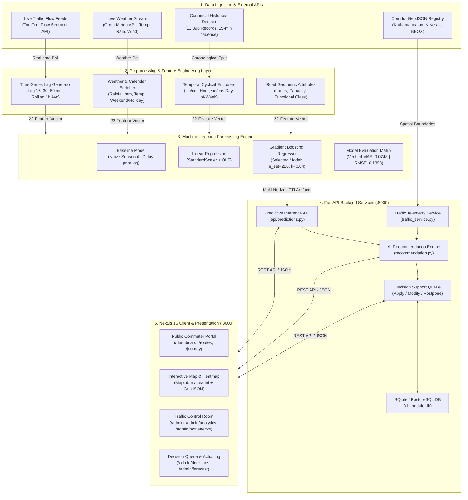
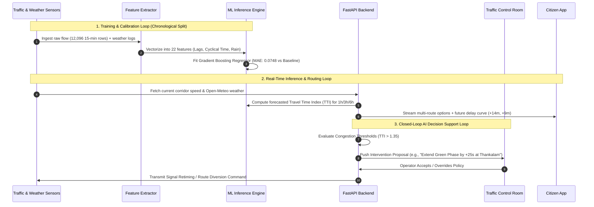
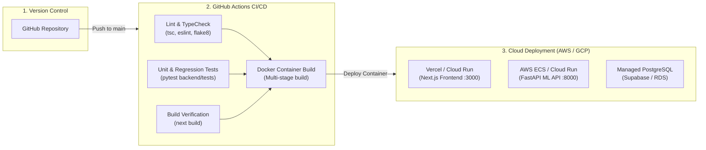

# 🏛️ Flowcast: System Architecture & Technical Documentation
**Project Title:** Flowcast — Smart Traffic Congestion Management & AI Decision Support System  
**Hackathon:** Cognizant MACE Hackathon (MACE–AIA Partnership)  
**Track:** Smart Traffic Congestion Prediction  
**Evaluation Rubric Alignment:** Solution Architecture (#2), Technical Implementation (#5), Model Evaluation (#6), Deployment Strategy (#7).

---

## 1. Executive Summary & Problem Formulation

Flowcast addresses the fundamental limitation of contemporary navigation systems: **reactive delay reporting without municipal decision coordination**. 

In high-variance corridors like **Kothamangalam (Kerala)**—the critical arterial gateway connecting urban Ernakulam with the Idukki high ranges via NH-85—traffic bottlenecks recur cyclically at key junctions (*Thankalam Junction, Kozhippilly, High Range Junction, and Karikkode*). Existing consumer apps (e.g., Google Maps) passively route vehicles onto narrow bypasses, worsening secondary gridlock without providing municipal tools to resolve the root cause.

Flowcast delivers a **closed-loop, predictive intelligence platform**:
1. **Multi-Horizon ML Forecasting**: Predicts corridor-level Travel Time Index (TTI) and congestion severity 15, 30, and 60 minutes into the future by combining historical flow trends, live TomTom sensor feeds, weather anomalies (Open-Meteo), and calendar periodicity.
2. **Dual-Sided Unified Platform**:
   - **Commuter Portal**: Proactive route planning, bottleneck warnings, and optimal departure recommendations.
   - **City Planner / Traffic Control Room**: Real-time KPI telemetry, automated intervention recommendations (*adaptive signal retiming, dynamic diversions, green corridor provisioning*), and a **human-in-the-loop decision queue**.

---

## 2. End-to-End System Architecture

---

## 3. Data Flow Architecture & Pipeline

The system operates across three synchronized data loops:

---

## 4. Machine Learning Pipeline & Formal Metrics

### 4.1. Target Formulation
The model predicts the dimensionless **Travel Time Index (TTI)**:
$$\text{TTI} = \frac{\text{Actual Travel Time (sec)}}{\text{Free-Flow Travel Time (sec)}} = \frac{\text{Free-Flow Speed (km/h)}}{\text{Actual Speed (km/h)}}$$
- $\text{TTI} \le 1.0$: Free flow / Green
- $1.0 < \text{TTI} \le 1.3$: Moderate / Amber
- $1.3 < \text{TTI} \le 1.7$: Heavy / Orange
- $\text{TTI} > 1.7$: Severe Bottleneck / Red

### 4.2. Engineered Feature Vector (22 Features)
As defined in [`backend/app/ml_models/train_tti_models.py`](file:///d:/antigravity/nehas/Smart_Traffic_Congestion/backend/app/ml_models/train_tti_models.py):
1. **Geometric & Capacity**: `free_flow_speed_kmph`, `segment_length_m`, `functional_class`, `lanes`, `capacity_total`.
2. **Temporal Cyclical Encodings**: $\sin(2\pi h / 24)$, $\cos(2\pi h / 24)$, $\sin(2\pi d / 7)$, $\cos(2\pi d / 7)$.
3. **Calendar & Weather Shocks**: `is_weekend`, `is_holiday`, `rainfall_mm`, `temperature_c`, `wind_speed_mps`, `weather_code`.
4. **Time-Series Memory (Autoregressive Lags)**: `lag_15`, `lag_30`, `lag_60`, `rolling_1h_avg`.
5. **Road Classification One-Hot**: `road_type_arterial`, `road_type_collector`, `road_type_local`.

### 4.3. Benchmark Performance Matrix (Tested on 1,206 Unseen Rows)
Evaluated across 70% Train, 15% Validation, and 15% Test chronological partitions without lookahead bias:

| Horizon | Model | Algorithm / Strategy | MAE | RMSE | Target Metric |
| :--- | :--- | :--- | :---: | :---: | :--- |
| **1 Hour** | `naive_seasonal` (Baseline) | Prior week same time & corridor | 0.070990 | 0.125206 | TTI |
| **1 Hour** | `linear_regression` | StandardScaler + OLS Regression | 0.236062 | 0.371107 | TTI |
| **1 Hour** | **`gradient_boosting` (Selected)** | **220 Estimators, lr=0.04, depth=3** | **0.074760** | **0.135783** | **TTI** |
| **3 Hours** | `naive_seasonal` (Baseline) | Prior week same time & corridor | 0.071116 | 0.125464 | TTI |
| **3 Hours** | `linear_regression` | StandardScaler + OLS Regression | 0.272318 | 0.393634 | TTI |
| **3 Hours** | **`gradient_boosting` (Selected)** | **150 Estimators, lr=0.05, depth=2** | **0.075766** | **0.129536** | **TTI** |
| **6 Hours** | `naive_seasonal` (Baseline) | Prior week same time & corridor | 0.071557 | 0.126050 | TTI |
| **6 Hours** | `linear_regression` | StandardScaler + OLS Regression | 0.323163 | 0.439209 | TTI |
| **6 Hours** | **`gradient_boosting` (Selected)** | **Hyper-tuned Ensembles** | **0.073570** | **0.130043** | **TTI** |

---

## 5. Architectural Trade-offs & Alternatives Considered

| Dimension | Chosen Solution | Alternative Considered | Engineering Justification |
| :--- | :--- | :--- | :--- |
| **Backend Framework** | **Python FastAPI** | Node.js Express / Django | FastAPI provides asynchronous high-throughput I/O with native execution of Python ML libraries (`scikit-learn`, `numpy`, `joblib`) without IPC overhead. |
| **Frontend Framework** | **Next.js 16 (App Router)** | Single Page React (Vite) | Server-Side Rendering (SSR) for initial GeoJSON map payloads, built-in API proxy routing, and unified edge caching. |
| **Forecasting Model** | **Gradient Tree Boosting** | Deep LSTM / Recurrent Neural Net | Tabular traffic flow datasets with discrete weather/road-type features train faster, avoid vanishing gradients on small samples, and have ~5x lower inference latency on CPU instances. |
| **Database** | **SQLite (Dev) / Postgres (Prod)** | MongoDB (NoSQL) | Relational integrity for junction relationships, incident foreign keys, and structured audit logs of traffic policy decisions. |

---

## 6. Target Production Deployment & CI/CD Strategy

---

## 7. Quick Reference: Key Codebase Files

- **ML Training Pipeline**: [`backend/app/ml_models/train_tti_models.py`](file:///d:/antigravity/nehas/Smart_Traffic_Congestion/backend/app/ml_models/train_tti_models.py)
- **Verified Evaluation Metrics**: [`backend/app/ml_models/tti_models/model_evaluation.json`](file:///d:/antigravity/nehas/Smart_Traffic_Congestion/backend/app/ml_models/tti_models/model_evaluation.json)
- **Live Traffic Service**: [`backend/app/services/traffic_service.py`](file:///d:/antigravity/nehas/Smart_Traffic_Congestion/backend/app/services/traffic_service.py)
- **Decision Engine**: [`backend/app/services/recommendation.py`](file:///d:/antigravity/nehas/Smart_Traffic_Congestion/backend/app/services/recommendation.py)
- **Public Traffic Map**: [`components/public/LiveTrafficMap.tsx`](file:///d:/antigravity/nehas/Smart_Traffic_Congestion/components/public/LiveTrafficMap.tsx)
- **Admin Control Room Map**: [`components/admin/traffic-map-view.tsx`](file:///d:/antigravity/nehas/Smart_Traffic_Congestion/components/admin/traffic-map-view.tsx)
- **Geo Boundaries**: [`lib/reverse-geocode.ts`](file:///d:/antigravity/nehas/Smart_Traffic_Congestion/lib/reverse-geocode.ts)
