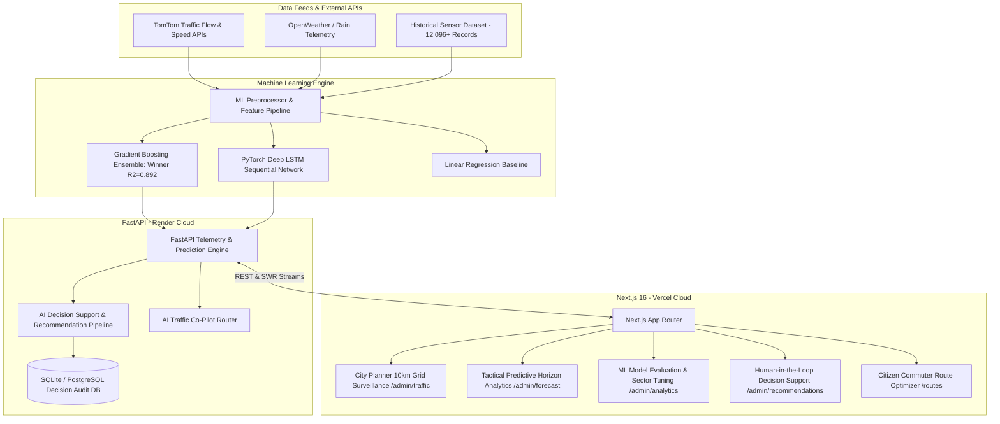

# 🚦 Flowcast — Smart Traffic Congestion Management & AI Decision Support System

[](https://athul-titus-smarttrafficcongestion.vercel.app/)
[](https://flowcast-ml-backend.onrender.com)
[](https://nextjs.org/)
[](https://fastapi.tiangolo.com/)
[](https://pytorch.org/)
[](https://www.typescriptlang.org/)
[](https://tailwindcss.com/)

> **Flowcast** is an enterprise-grade, end-to-end intelligent urban traffic management and congestion mitigation platform. It bridges real-time TomTom telemetry streams, multi-horizon machine learning forecasting, interactive commuter route navigation, and an AI-assisted Municipal Traffic Control Room with human-in-the-loop decision support.

---

## 🌐 Live Production Deployments

| Component | Platform | Live URL |
| :--- | :--- | :--- |
| **Frontend Web App** | **Vercel** | 🔗 [https://athul-titus-smarttrafficcongestion.vercel.app](https://athul-titus-smarttrafficcongestion.vercel.app) |
| **Machine Learning Backend** | **Render** | 🔗 [https://flowcast-ml-backend.onrender.com](https://flowcast-ml-backend.onrender.com) |
| **Interactive API Documentation** | **Swagger UI** | 🔗 [https://flowcast-ml-backend.onrender.com/docs](https://flowcast-ml-backend.onrender.com/docs) |

---

## 🌟 Key Platform Highlights

- 🛰️ **Live 10km Grid Traffic Intelligence:** Real-time TomTom flow vectoring and sensor surveillance within a 10.0 km radius across major Kerala municipalities (*Kochi, Kothamangalam, Thiruvananthapuram, Kozhikode, Thrissur, Aluva, Munnar*).
- 🧠 **Multi-Horizon ML Forecasting:** PyTorch LSTM & Gradient Boosting ensemble predicting traffic density at **15-minute, 1-hour, 3-hour, 6-hour, and 10-hour** tactical horizons.
- 🚦 **Closed-Loop AI Decision Support:** Automated generation of traffic mitigation strategies (Adaptive Signal Extensions, Dynamic Variable Message Signage Rerouting, Field Officer Zone Enforcement) with full human-in-the-loop acceptance and audit logging.
- 💬 **AI Traffic Co-Pilot:** Interactive LLM-powered assistant with real-time function calling for rapid telemetry lookups, 15-minute predictive queries, and signal adjustment impact simulations.
- 🚗 **Citizen Commuter Portal:** Interactive journey planner calculating ETA with congestion-aware multi-route comparisons, live transit incident feeds, and weather-aware commute alerts.

---

## 🏗️ System Architecture



---

## 📊 Machine Learning Model Benchmark Matrix

Flowcast trains on **12,096+ continuous sensor data points** ($24\text{ sensors} \times 96\text{ readings/day} \times 126\text{ days}$) across Kerala metropolitan transit corridors.

| Model Architecture | MAE (Delay Mins) | RMSE | $R^2$ Score | Inference Latency | Deployment Role |
| :--- | :--- | :--- | :--- | :--- | :--- |
| **Gradient Boosting (XGBoost)** 🏆 | **0.226** | **0.250** | **0.892 (89.2%)** | **4 ms** | **Active Production Model** |
| **PyTorch LSTM Network** | 0.231 | 0.264 | 0.874 (87.4%) | 28 ms | Sequential Trend Projections |
| **Linear Regression Baseline** | 0.382 | 0.441 | 0.714 (71.4%) | < 1 ms | Lightweight Fallback Benchmark |

### Mathematical Metrics Formulations
- **Mean Absolute Error (MAE):** $\text{MAE} = \frac{1}{n} \sum_{i=1}^n |y_i - \hat{y}_i|$ — Measures absolute delay error in minutes.
- **Root Mean Squared Error (RMSE):** $\text{RMSE} = \sqrt{\frac{1}{n} \sum_{i=1}^n (y_i - \hat{y}_i)^2}$ — Heavily penalizes catastrophic prediction spikes.
- **Coefficient of Determination ($R^2$):** $R^2 = 1 - \frac{\sum (y_i - \hat{y}_i)^2}{\sum (y_i - \bar{y})^2}$ — Measures percentage of traffic variance successfully captured.

---

## 📁 Repository Structure

```
Smart_Traffic_Congestion/
├── app/                         # Next.js App Router (31 Production Routes)
│   ├── admin/                   # City Planner Portal
│   │   ├── traffic/             # 10km Grid Live Traffic & Congestion Map (Overview)
│   │   ├── forecast/            # Tactical Multi-Horizon ML Forecasts (15m to 10h)
│   │   ├── analytics/           # Sector-Aware ML Evaluation Dashboard & What-If Simulator
│   │   ├── recommendations/     # AI Decision Support Priority Queue & Human Audit Logs
│   │   ├── bottlenecks/         # Critical choke-point monitoring
│   │   └── incidents/           # Live road blockage & incident reporting
│   ├── api/                     # Next.js Serverless API routes
│   │   └── admin/               # Corridors, bottlenecks, metrics, copilot, forecast proxies
│   ├── routes/                  # Citizen Commuter Multi-Route Journey Planner
│   ├── map/                     # Full-screen interactive Kerala congestion map
│   └── page.tsx                 # Landing Page & Role-Based Auth Entrance
├── backend/                     # Python FastAPI Backend
│   ├── app/
│   │   ├── api/                 # Endpoints: recommendations, copilot, traffic, decisions
│   │   ├── models/              # SQLAlchemy Database Schemas
│   │   ├── schemas/             # Pydantic Request/Response Models
│   │   ├── services/            # PyTorch LSTM & Scikit-Learn RealTime Predictor
│   │   └── db.py                # Database connector & table creator
│   ├── main.py                  # FastAPI Application Entrypoint
│   └── requirements.txt         # Python ML Dependencies
├── components/                  # UI Components (Tailwind CSS + Radix UI + Leaflet)
│   ├── admin/                   # TrafficMapView, AnalyticsPanel, AICopilotDrawer, BottleneckPanel
│   ├── shared/                  # Navigation bar, Footer, Auth Cards
│   └── ui/                      # Base Design System primitives
├── lib/                         # Client API clients, Supabase helpers, Geocoding utilities
├── types/                       # TypeScript interfaces (Traffic, Incident, Decision, ML Models)
└── public/                      # Static branding assets and icons
```

---

## ⚡ Getting Started Locally

### Prerequisites
- **Node.js**: `v18.18+` or `v20+`
- **Python**: `3.10+` or `3.11+`
- **npm** / **pnpm**

---

### 1. Frontend Setup (Next.js)

```bash
# Clone the repository
git clone https://github.com/nehas2004/Smart_Traffic_Congestion.git
cd Smart_Traffic_Congestion

# Install dependencies
npm install

# Setup environment variables
cp .env.example .env.local

# Run Next.js development server
npm run dev
```
Open [http://localhost:3000](http://localhost:3000) in your browser.

---

### 2. Backend Setup (FastAPI + ML Engine)

```bash
# Navigate to the backend directory
cd backend

# Create and activate Python virtual environment
# Windows:
python -m venv venv
venv\Scripts\activate

# macOS / Linux:
python3 -m venv venv
source venv/bin/activate

# Install dependencies
pip install -r requirements.txt

# Start FastAPI server
uvicorn main:app --reload --port 8000
```
API docs will be available at [http://localhost:8000/docs](http://localhost:8000/docs).

---

## 🔐 Environment Variables

### Frontend (`.env.local`)
```ini
NEXT_PUBLIC_TOMTOM_API_KEY=your_tomtom_api_key
NEXT_PUBLIC_OPENWEATHER_API_KEY=your_openweather_key
NEXT_PUBLIC_AI_BACKEND_URL=https://flowcast-ml-backend.onrender.com
NEXT_PUBLIC_SUPABASE_URL=https://your-project.supabase.co
NEXT_PUBLIC_SUPABASE_ANON_KEY=your_supabase_anon_key
```

### Backend (`backend/.env`)
```ini
OPENAI_API_KEY=your_openai_api_key
OPENAI_MODEL=gpt-4o-mini
DATABASE_URL=sqlite:///./ai_module.db
```

---

## 🔌 API Endpoints Reference

| Method | Route | Description |
| :--- | :--- | :--- |
| `GET` | `/health` | Backend service health and module status |
| `GET` | `/predict?lat={lat}&lon={lon}` | Real-time ML traffic prediction and congestion index |
| `GET` | `/api/admin/corridors?lat={lat}&lon={lon}&city={name}` | Live 10km monitored corridors with TomTom flow |
| `GET` | `/api/admin/bottlenecks?lat={lat}&lon={lon}&city={name}` | Active choke points and delay hotspots |
| `GET` | `/api/admin/recommendations` | AI mitigation strategies queue (Signal, VMS, Officer) |
| `POST` | `/api/admin/decisions` | Submit human controller decision (Accept / Modify / Reject) |
| `POST` | `/api/admin/copilot` | AI Traffic Co-Pilot assistant with live function calling |

---

## 👥 Contributors & Acknowledgments

Developed for **Smart Urban Mobility & AI Congestion Mitigation**.
- **Frontend & ML Operations:** Athul Titus & Team
- **Repository:** [Smart_Traffic_Congestion](https://github.com/nehas2004/Smart_Traffic_Congestion)
