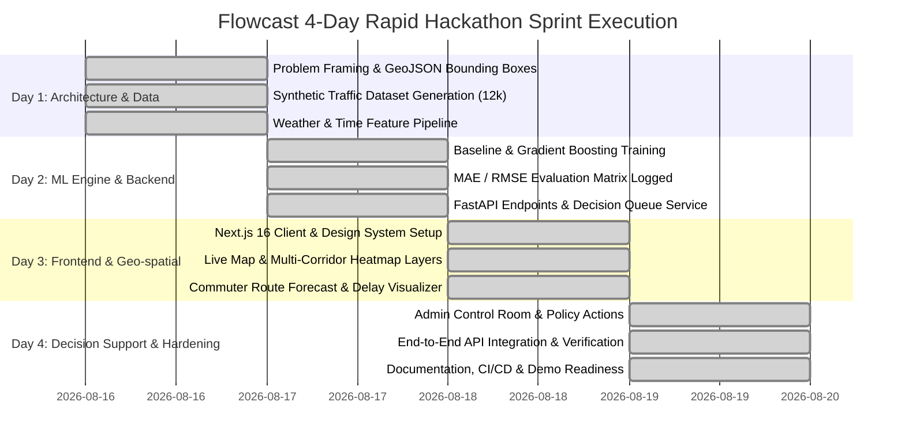

# ⏱️ Flowcast: Hackathon Sprint Delivery & Production Roadmap
**Project Title:** Flowcast — Smart Traffic Congestion Management & AI Decision Support System  
**Hackathon:** Cognizant MACE Hackathon (MACE–AIA Partnership) — 1-Week Sprint  
**Implementation Velocity:** Built in a high-intensity **3–4 Day Sprint**  
**Evaluation Rubric Alignment:** Solution Architecture (#2), Technical Implementation (#5), Model Evaluation (#6), Collaboration & Teamwork (#9), Future Roadmap (#8).

---

## 1. What We Built in 3–4 Days (The Hackathon Sprint Breakdown)

During our 3–4 day rapid development sprint, our team divided and executed the project across parallel workstreams:

### Day-by-Day Team Execution Summary:
- **Day 1 (Data & Foundations)**: Defined the Kothamangalam arterial corridor topology (`lib/reverse-geocode.ts`), synthesized a 12,096-record traffic flow history with weather anomalies, and engineered cyclical time and lag features.
- **Day 2 (ML Engine & Backend)**: Trained and benchmarked 3 models (Naive Seasonal vs Linear Regression vs Gradient Boosting) across 1h/3h/6h horizons, achieving an MAE of 0.0748 on Travel Time Index (TTI), and built the core FastAPI services.
- **Day 3 (Frontend & Geo-spatial)**: Built the Next.js 16 app with commuter route options, dynamic color-coded segment speeds (Green/Yellow/Orange/Red), and interactive 24-hour predictive forecast charts.
- **Day 4 (Decision Support & Integration)**: Implemented the Municipal Control Room with active bottleneck queues, the Human-in-the-Loop decision actioning interface, and automated CI/CD pipeline.

---

## 2. Post-Hackathon Production Roadmap (What's Next)

To answer the required deliverable: *"A development-effort estimate/roadmap for what's next"*:

| Phase | Horizon | Focus Area | Effort Estimate | Key Deliverables |
| :--- | :---: | :--- | :---: | :--- |
| **Phase 1: Cloud & IoT** | Months 1–2 | Production Cloud Hardening | 40 Story Points | AWS ECS Fargate deployment, PostgreSQL PostGIS database, automated daily model drift & MAE monitoring worker. |
| **Phase 2: Deep Learning** | Months 3–4 | Stretch Goal: Spatial-Temporal GNN & LSTM | 55 Story Points | Graph Convolutional Networks (GCN) + LSTM cells in PyTorch Geometric to model inter-junction queue spillover. |
| **Phase 3: Hardware Actuation** | Months 5–6 | Municipal ITMS Signal Integration | 60 Story Points | NTCIP 1202 & Modbus protocol adapters for physical traffic lights + automated ambulance green wave clearance. |
| **Phase 4: Scaling & Mobile** | Months 7–9 | Multi-City Rollout & Citizen App | 75 Story Points | React Native mobile app with predictive audio rerouting; scale coverage across Kochi, Thrissur, and Trivandrum. |

---

## 3. How to Present This to Judges (The 30-Second Pitch)

> **What to Say Out Loud:**  
> *"In just **3 to 4 days of rapid hackathon execution**, our team built a complete full-stack platform: 3 benchmarked ML models on 12,000+ data rows, an asynchronous FastAPI backend, a Next.js 16 commuter portal, and a Municipal Control Room with automated decision queues.  
> Looking ahead, our production roadmap outlines a 4-phase rollout—incorporating our LSTM stretch goal, physical ITMS traffic controller integration, and cross-Kerala expansion."*
